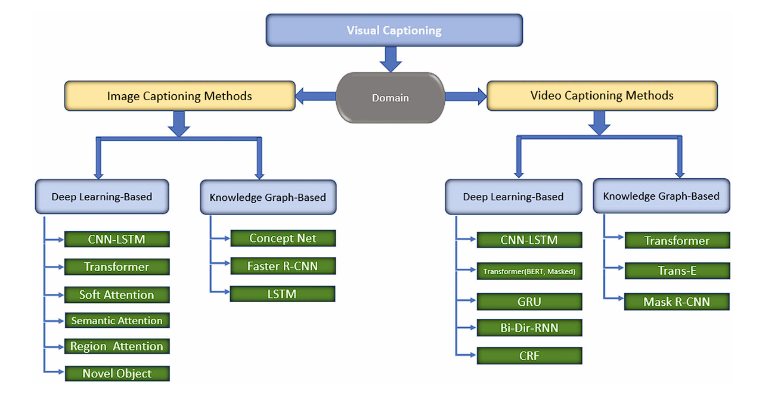

# Tôi ôn bài để làm Thesis

## I. Image Captioning
### I.1 Deep-learning for Image Captioning

### CNN - LSTM

### Transformer

### Self-Attention

### Region Attention

### Novel Object 

### I.2 Knowledge Graph for Image Captioning

## II. Video Captioning
### II.1 Deep-learning for Video Captioning

### Transformer()
### CNN - LSTM
### CNN - LSTM
### CNN - LSTM
### CNN - LSTM

### II.2 Knowledge Graph for Image Captioning

