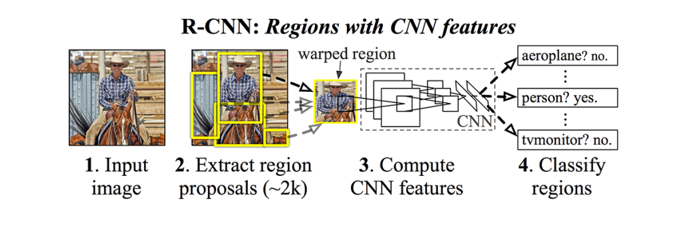
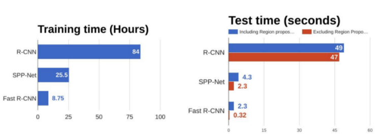
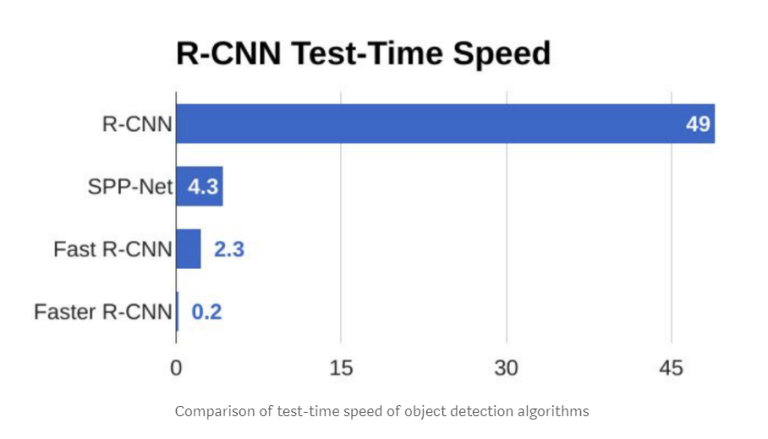

# Tôi ôn bài để làm Thesis

<figure>
  
  <figcaption>Cái này là nền tảng</figcaption>
</figure>

# I. Image Captioning
## I.1 Deep-learning for Image Captioning

### CNN - LSTM

### Transformer

### Self-Attention

### Region Attention

### Novel Object 

## I.2 Knowledge Graph for Image Captioning

### Faster R-CNN 
**1. R-CNN (Region with CNN feature)**. 
Ý tưởng thuật toán R-CNN như sau:
- Bước 1: Dùng Selective Search algorithm để lấy ra khoảng 2000 bounding box trong input mà có khả năng chứa đối tượng.
- Bước 2: Với mỗi bounding box ta xác định xem nó là đối tượng nào (người, ô tô, xe đạp,…)

**Selective Search**: Input là ảnh màu và Output là khoảng 2000 region proposal có khả năng chứa các đối tượng. 
Đầu tiên ảnh được segment qua thuật toán Graph-based Image Segmentation 

<figure>
  
  <figcaption>Output sau khi thực hiện graph based image segmentation. Nguồn: <a href="https://www.learnopencv.com/selective-search-for-object-detection-cpp-python/">https://www.learnopencv.com/selective-search-for-object-detection-cpp-python/</a></figcaption>
</figure>

Ta không thể dùng mỗi màu trong output để làm 1 region proposal được vì:

- Mỗi đối tượng trong ảnh có thể chứa nhiều hơn 1 màu.
- Các đối tượng bị che mất một phần như cái đĩa dưới cái chén không thể xác định được.

=> Cần nhóm các vùng màu với nhau để làm region proposal.

Tiếp theo, các vùng màu được nhóm với nhau dựa trên độ tương đồng về màu sắc, hướng gradient, kích thước,… 
Cuối cùng các region proposal được xác định dựa trên các nhóm vùng màu.

**Phân loại Region Proposal** 
Bài toán trở thành phân loại ảnh cho các region proposal. Do **Selective search** cho tới 2000 region proposal nên có rất nhiều region proposal không chứa đối tượng nào. Vậy nên ta cần thêm 1 lớp background (không chứa đối tượng nào). Ví dụ như hình dưới ta có 4 region proposal, ta sẽ phân loại mỗi bounding box là người, ngựa hay background.

<figure>
  
  <figcaption>Nguồn: Rich feature hierarchies for accurate object detection and semantic segmentation</figcaption>
</figure>

Sau đó các region proposal được resize lại về cùng kích thước và thực hiện transfer learning với feature extractor, sau đó dùng  các extracted feature được cho vào Support Vector Machine (SVM) để phân loại ảnh.

Bên cạnh đó thì extracted feature cũng được dùng để dự đoán 4 offset values cho mỗi cạnh. Ví dụ như khi region proposal chứa người nhưng chỉ có phần thân và nửa mặt, nửa mặt còn lại không có trong region proposal đó thì offset value có thể giúp mở rộng region proposal để lấy được toàn bộ người.

**Vấn đề của R-CNN**
- Vì với mỗi ảnh ta cần phân loại các class cho 2000 region proposal nên thời gian train rất lâu.
- Không thể áp dụng cho real-time vì mỗi ảnh cũng tốn rất lâu

**2. Fast R-CNN (Region with CNN feature)**. 
Tương tự R-CNN, Fast R-CNN vẫn dùng selective search để lấy ra các region proposal.Điểm khác biệt nằm ở chỗ: Fast R-CNN cho cả bức ảnh vào **ConvNet** (một vài convolutional layer + max pooling layer) để tạo ra convolutional feature map.

Sau đó các vùng region proposal được lấy ra tương ứng từ convolutional feature map. Tiếp đó được Flatten và thêm 2 **Fully connected layer (FCs)** để d ự đoán lớp của region proposal và giá trị offset values của bounding box.

<figure>
  
  <figcaption> Kiến trúc Fast R-CNN. Nguồn: <a href="https://arxiv.org/pdf/1504.08083.pdf">https://arxiv.org/pdf/1504.08083.pdf</a> </figcaption>
</figure>

Tuy nhiên, vì kích thước của các region proposal khác nhau nên khi Flatten sẽ ra các vector có kích thước khác nhau nên không thể áp dụng neural network được. R-CNN đã resize các region proposal về cùng kích thước trước khi dùng transfer learning. Tuy nhiên ở feature map ta không thể resize được, nên ta phải có cách gì đấy để chuyển các region proposal trong feature map về cùng kích thước => **Region of Interest (ROI) pooling** ra đời.

**Region of Interest (ROI) pooling**
Đây là 1 dạng của **pooling layer**. So với max pooling hay average pooling là bất kể kích thước của tensor input, ROI pooling luôn cho ra output có kích thước cố định được định nghĩa trước.

Ta kí hiệu a/b và a%b là phần nguyên và phần dư của a khi chia cho b và. Ví dụ: 10/3 = 3 và 10%3 = 1. 
Gọi input của ROI pooling kích thước m x n và output có kích thước h x k (Thường h & k nhỏ, giả dụ h = k = 7)

- Chia chiều rộng thành h phần, (h-1) phần có kích thước m/h, phần cuối có kích thước m/h + m%h.
- Chia chiều dài thành k phần, (k-1) phần có kích thước n/k, phần cuối có kích thước n/k + n%k.

Ví dụ: 
Cho m = n = 10, h = k = 3 =>? m / h = 3 và m % h = 1, nên ta sẽ chia chiều rộng thành 3 phần, 2 phần có kích thước 3, và 1 phần có kích thước 4.

<figure>
  
  <figcaption>Input của ROI Pooling sau khi chia</figcaption>
</figure>

Với mỗi khối được tạo ra bằng các đường đỏ và cạnh, ta thực hiện max pooling lấy ra 1 giá trị.

<figure>
  
  <figcaption>Thực hiện ROI Pooling</figcaption>
</figure>

Ta có thể thấy là kích thước sau khi thực hiện ROI pooling về đúng h*k như ta mong muốn. (3x3)

**Đánh giá**

<figure>
  
  <figcaption>So sánh thời gian train và test giữa R-CNN và Fast R-CNN. Nguồn:
  <a href="https://towardsdatascience.com/r-cnn-fast-r-cnn-faster-r-cnn-yolo-object-detection-algorithms-36d53571365e">https://towardsdatascience.com/r-cnn-fast-r-cnn-faster-r-cnn-yolo-object-detection-algorithms-36d53571365e</a>
</figcaption>
</figure>

- Khác với R-CNN, Fast R-CNN feature map với cả ảnh sau đó với lấy các region proposal ra từ feature map, còn R-CNN tách các region proposal ra rồi mới thực hiện CNN trên từng region proposal. Do đó Fast R-CNN nhanh hơn đáng kể nhờ tối ưu việc tính toán bằng Vectorization.
- Tuy nhiên, thời gian tính region proposal rất lâu và làm chậm thuật toán => Cần thay thế **Selective search** bằng cách dùng Deep Learning để tạo Region Proposal => Faster R-CNN ra đời. 

**3. Faster R-CNN**

Thay vì sử dụng **Selective search**, Faster R-CNN dùng 1 CNN mới là Region Proposal Network (RPN) để tìm các region proposal

<figure>
  
  <figcaption>Kiến trúc mới Faster R-CNN. Nguồn:
  <a href="https://arxiv.org/pdf/1506.01497.pdf">https://arxiv.org/pdf/1506.01497.pdf</a>
</figcaption>
</figure>

Đầu tiên cả bức ảnh được cho qua pre-trained model để lấy feature map. Sau đó feature map được dùng cho Region Proposal Network để lấy được các region proposal. Sau khi lấy được vị trí các region proposal thì thực hiện tương tự Fast R-CNN.

**Region Proposal Network (RPN)**
Input của RPN là feature map và output là các region proposal. Ta thấy các region proposal là hình chữ nhật.

<figure>
  
</figure>

Một hình chữ nhật được xác định bằng 2 điểm ở 2 góc, ví dụ A(`x_min`, `y_min`) và B(`x_min`, `y_max`).
- Khi RPN dự đoán ta phải rằng buộc `x_min` < `x_min` và `y_min` < `y_max`
- Hơn nữa x,y khi dự đoán có thể ra ngoài khỏi bức ảnh

=> Cần một kĩ thuật mới để biểu diễn region proposal => **Anchor** ra đời. Thay vì dự đoán 2 góc ta sẽ dự đoán điểm trung tâm (`x_center`, `y_center`) và `width`, height của hình chữ nhật. Như vậy mỗi **Anchor** được xác định bằng 4 tham số (`x_center`, `y_center`, `width`, `height`).

Vì không sử dụng Selective search nên RPN ban đầu cần xác định các anchor box có thể là region proposal, sau đó qua RPN thì chỉ ouput những anchor box chắc chắn chứa đối tượng.

<figure>
  
  <figcaption>Minh họa RPN</figcaption>
</figure>

Ảnh bên trái kích thước 400x600 pixel, tác tâm của anchor box màu xanh, cách nhau 16 pixel => có khoảng (400x600)/(16x16) = 938 tâm. Do các object trong ảnh có thể có kích thước và tỉ lệ khác nhau nên với mỗi tâm ta định nghĩa 9 anchors với kích thước 64×64, 128×128, 256×256, mỗi kích thước có 3 tỉ lệ tương ứng: 1 : 1, 1 : 2 và 2 : 1.

Giống như hình bên phải với tâm ở giữa 3 kích thước ứng với màu da cam, xanh lam, xanh lục và với mỗi kích thước có 3 tỉ lệ.

=> Số lượng anchor box giờ là 938 * 9 = 8442 anchors. Tuy nhiên sau RPN ta chỉ giữ lại khoảng 1000 anchors box để thực hiện như trong Fast R-CNN.

**Tương tự Selective Search, việc của RPN là lấy ra các region proposal chứ không phải là phân loại ảnh.**

Mô hình RPN khá đơn giản, feature map được cho qua Conv layer 3*3, 512 kernels. Sau đó với mỗi anchor lấy được ở trên, RPN thực hiện 2 bước:

- Dự đoán xem anchor đấy là foreground (chứa object) hay background (không chứa object)
- Dự đoán 4 offset value cho x_center, y_center, width, height cho các anchor.

Nhận xét: có rất nhiều anchor bị chồng lên nhau nên non-maxima suppression được dùng để loại bỏ các anchor chồng lên nhau. 
Sau cùng dựa vào phần trăm dự đoán background RPN sẽ lấy N anchor (N có thể 2000, 1000, thậm chí 100 vẫn chạy tốt) để làm region proposal.

**Intersection over Union (IoU)**
IoU được xử dụng trong bài toán object detection, để đánh giá xem bounding box dự đoán đối tượng **khớp** với ground truth của đối tượng.

<figure>
  
  <figcaption>Minh họa IoU</figcaption>
</figure>

Ví dụ về hệ số IoU, nhận xét:
- Chỉ số IoU trong khoảng [0,1]
- IoU càng gần 1 thì bounding box dự đoán càng gần ground truth
<figure>
  
  <figcaption>Minh họa IoU</figcaption>
</figure>

Ngoài ra thì IoU cũng được dùng để đánh giá độ khớp của 2 hình chữ nhật.

**Non-maxima suppression**

Trong Region Proposal Network đầu tiên ta có khoảng 9000 anchor box (tập Input) tuy nhiên ta chỉ muốn giữ lại 100 anchor (tập Output) làm region proposal. Cách làm:
- Bước 1: Chọn ra anchor box (A) có xác xuất là foreground lớn nhất trong tập Input
- Bước 2: Thêm A vào tập Output.
- Bước 3: Loại bỏ A và các anchor box trong tập Input mà có hệ số IoU với A lớn hơn 0.5 ra khỏi tập Input.
- Bước 4: Kiểm tra nếu tập Input rỗng hoặc tập Output đủ 100 anchor thì dừng lại, nếu không quay lại bước 1.

**Đánh giá**
Kết quả của Faster R-CNN

<figure>
  
</figure>

Có thể thấy Faster R-CNN nhanh hơn hẳn các dòng R-CNN trước đó, vì vậy có thể dùng cho real-time objec detection

## II. Video Captioning
### II.1 Deep-learning for Video Captioning

### Transformer()
### CNN - LSTM
### CNN - LSTM
### CNN - LSTM
### CNN - LSTM

### II.2 Knowledge Graph for Image Captioning

